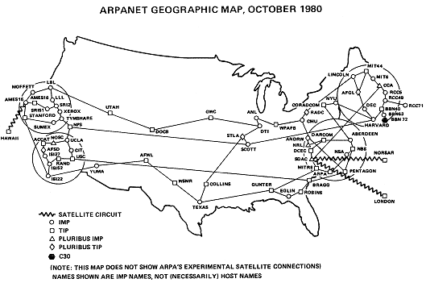
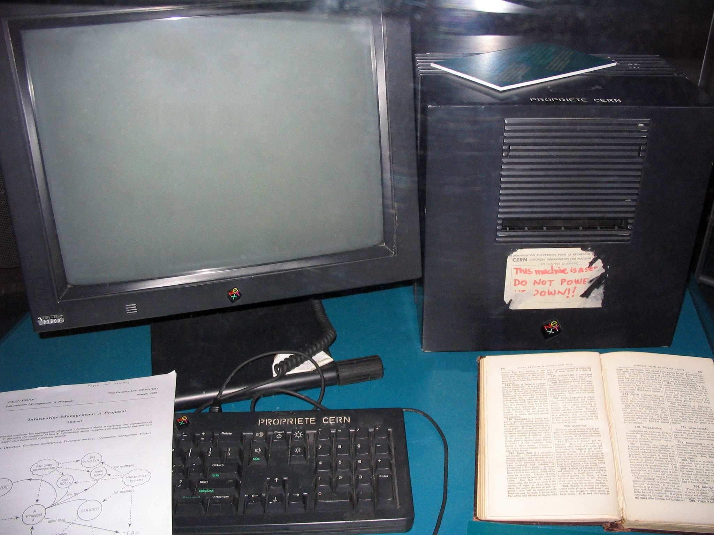

### HF Interactiondesign
# Internet 1×1


Stefan Huber, Zürich – 2017 <!-- .element: class="footer" -->
--s--
## News
* [Apple Keynote](https://www.apple.com/)
* [iPhone X – animoji](https://www.youtube.com/watch?v=F-N1CLArUUQ)
  * [Microsoft Kinect](https://en.wikipedia.org/wiki/Kinect)
  * [Z-Information](https://www.youtube.com/watch?v=uq9SEJxZiUg)
  * Z-Information (Depth-of-Field) seit iPhone 7 Plus
--s--
## Agenda
* [Digital Festival](http://digitalfestival.ch/)
* [ZHdK Highlights](https://www.zhdk.ch/veranstaltung/32483)
--s--
## Krankheit & Abwesenheit
* Koordination unter den Studierenden
* Material/Links weiter geben
* Wo nötig Dozierende anfragen
--s--
# Rückschau
--s--
## Github.com
* Versionsverwaltung
* Technologie: git
* [→ Wiki](https://github.com/logrinto/webtypo/wiki)
  * Wolfgang Schoeck – bitte Einladung annehmen
  * Marc Hatt – bitte Einladung annehmen
* [→ Issues](https://github.com/logrinto/IAD2017/issues)
* Pull Requests (mehr Infos heute)
--s--
## Kontakte & Passworte
* [→ Online Kontakte](https://logrinto.github.io/IAD2017.students/)
  * Pascale – bitte nachreichen
--s--
## Divis vs. Halbgeviert
* [Demo Webtypo](https://github.com/logrinto/webtypo/wiki)
--s--
## Rückschau Dokumente Strukturieren
--s--
## Wo startet und wo endet Tag
Zum Teil nicht ganz einfach zu unterscheiden.

<br>

## Beispiel
* ! Start  ! Party ! more Party  

oder gar
* ! Start!  ! Party! ! more Party!
--s--
## Escaping

* Zeichen die Inhalt sind, aber als Strukturierung kollidieren

<br>

## Beispiel
* `{Titel}` <br>→ `{` `}` = Strukturierung  
* `{Schnautzklammern sind: {}}` <br>→ `{` `}` = Strukturierung oder Inhalt
--s--
## Weissraum
* Wo steht eine Blindzeile? Wo ein Wortabstand?

<br>

## Beispiel
{Titel}(Text)  
--s--
## HTML 1×1
--s--
## Wenige Regeln
* Inhalt steht zwischen zwei Tags (`<p>`Inhalt`</p>`)
* Ein öffnender Tag am Anfang vom Inhalt (`<p>`)
* Ein schliessender Tag am Ende vom Inhalt (`</p>`)
* ...
--s--
## Simple Tags

* `<p>`...`</p>` = Paragraph (Textabschnitt)
* `<h1>`...`</h1>` = Heading 1 (Titel 1. Stufe)
* `<ul>`...`</ul>` = Unordered List (Liste ungeordnet)
* `<li>`...`</li>`  =  List Item (Listenelement)
* ...
--s--
## Escaping im Inhalt

* `<`  wird zu `&lt;`
* `>`  wird zu `&gt;`
* `&`  wird zu `&amp;`
* ...

--s--
## Beispiel

```
<h1>Titel</h1>
<p>Text</p>
<ul>
  <li>Eintrag A</li>
  <li>Eintrag B</li>
</ul>
```
--s--
## «HTML-Rumpf» fehlt
```
<!DOCTYPE html>
<html lang="de">
  <head>
    <meta charset="utf-8">
    <title>Test</title>
  </head>
  <body>
    ...
  </body>
</html>
```
--s--
# Go online mit Github
--s--
## Arbeitslast

# Umfrage
* Wie war die Arbeitslast diese (KW36 – KW37) Woche?

--s--
# Und heute?

--s--
## Übersicht – Nachmittag

* **12:45** · Installation
  * Internet · 1×1
  * HTML · 1×1 («Experimentelles Erzählen»)
    * CSS
    * Pull Requests
  * DNS · Domains
* **16:15** · Ende
--s--
# Internet · 1×1
* Informationsausbreitung
* Entwicklung vom «modernen» Internet
--s--
# Internet <br>= Distribution von Information

--s--
## Distribution von Information
* Schriftlich (persistent)
* Mündlich (flüchtig)
--s--
## Schriftliche Distribution
* Notizen/Briefe
* Bücher
--s--
## Notizen/Briefe
* Formell oder informell
* Loser Verbund an Information
* Updates durch Ergänzung/Streichung (Editierung)
* Hohe Verbreitung
--s--
## Bücher
* Abschliessender Umfang an Information
* Aktualisierung nur bei Neuauflage
* Über Jahrhunderte sehr teuer (Material nicht Arbeit)
--s--
## Buchproduktion
Vergleich handschriftliche Codices vs. modernem Buch <!-- .element: class="small" -->


--s--
## Buchproduktion
Vergleich handschriftliche Codices vs. modernem Buch <!-- .element: class="small" -->


--s--
## Information reist schneller als ein Medium
Informationsübertragung nach London in km/h <!-- .element: class="small" -->


A Farewell to Alms – A Brief Economic History of the World, Gregory Clark, Princeton University Press, 2007 <!-- .element: class="footer" -->

--s--
## Das Physische Medium wird überflüssig


Börsentelegrafen, Thomas Edison, 1869 <!-- .element: class="footer" -->

--s--
# Telegrafen – Kabel
* Demo

--s--
## Paketvermittelte Kommunikation

Information wird in kleinere Einheiten verpackt.

### Vorteile
* Last- und Risikoverteilung
* Teile können neu gesendet werden

--s--
## Struktur des Internet

* Auftrag vom US-Verteidigungsministerium
* Verbindet 1969 vier Universitäts-Rechner
* Start an der Westküste – Silicon Valley
* Flexiebles Kommunikationsprotokoll TCP/IP

ARPAnet = Advanced Research Projects Agency Network <br>
TCP/IP = (Transmission Control Protocol/Internet Protocol) <!-- .element: class="footer" -->
--s--
## Struktur des Internet


ARPAnet 1969 <!-- .element: class="footer" -->
--s--

## Struktur des Internet


ARPAnet 1971 <!-- .element: class="footer" -->
--s--
## Struktur des Internet

 <!-- .element: class="pic" -->

ARPAnet 1980 <!-- .element: class="footer" -->
--s--
## Frage

Was ist der Unterschied zwischen www und Internet?

www = World Wide Web <!-- .element: class="footer" -->

--s--
## Antwort

Am ehesten so:

### Internet
* Infrastruktur auf dem Services betrieben werden können

### www
* Ein spezifisches Set an Services
--s--
## WWW wird erfunden

* Wurde in Genf erfunden (CERN)
* Informationen verknüpfen (to browse)
* Information strukturiert zugänglich machen, aber Struktur nicht vorgeben.
* Inhalt zählte und nicht Aussehen
* 1989 Vorschlag WWW (mit HTML)
* 1990 erste Website
* 1991 über das CERN hinaus

--s--

## Tim Berners-Lee

 <!-- .element: class="pic" -->

<div>
[Wikimedia – Tim Berners-Lee – 2012](https://en.wikipedia.org/wiki/File:Tim_Berners-Lee_2012.jpg)
</div> <!-- .element: class="footer" -->
--s--
## Erster Webserver

 <!-- .element: class="pic" -->


<div>
[Wikimedia – First Web server](https://en.wikipedia.org/wiki/File:First_Web_Server.jpg)
</div> <!-- .element: class="footer" -->
--s--
## Erste Website
<iframe class="browser" src="http://info.cern.ch/hypertext/WWW/TheProject.html" frameborder="0"></iframe>

--s--

## Kommunikation hat sich verschoben
Briefpost in den USA seit 2001 rückläufig


<div>
[First-Class Mail Volume Since 1926](http://about.usps.com/who-we-are/postal-history/first-class-mail-since-1926.htm)
</div> <!-- .element: class="footer" -->

--s--
## Durchdringung im Markt

--s--
# HTML · 1×1

--s--
## Pull Requests
* Dient zur Zusammenarbeit

--s--
## Pull Requests
* Demo Pull Requests


--s--
## CSS

* Cascading Style Sheets (CSS)
* 1996 publiziert
* Inhalt und Darstellung werden auseinander gehalten

--s--
## Prinzipien

* Selektorne wählen Inhalt aus
* Eigenschaften werden angewendet

--s--
## Selektoren
* Tag
* Klasse (class)
* ID (id)
--s--
## Tag-Selektoren

### HTML
```
<p>Hier steht Text</p>
```

### CSS
```
p {
  color: red;
}
```

--s--
## Tag-Selektoren

### HTML
```
<p class="blau">Hier steht Text</p>
```

### CSS
```
.blau {
  color: blue;
}
```

--s--
## ID-Selektoren

### HTML
```
<p id="text">Hier steht Text</p>
```

### CSS
```
#text {
  color: green;
}
```

--s--
## Freie Arbeit
