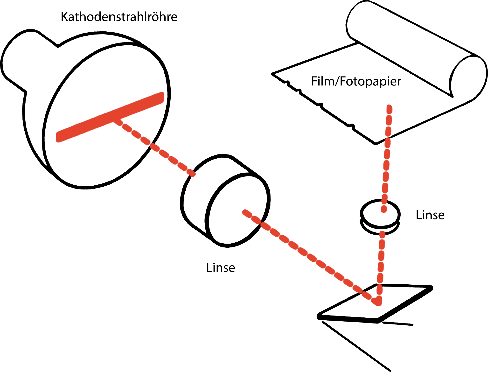
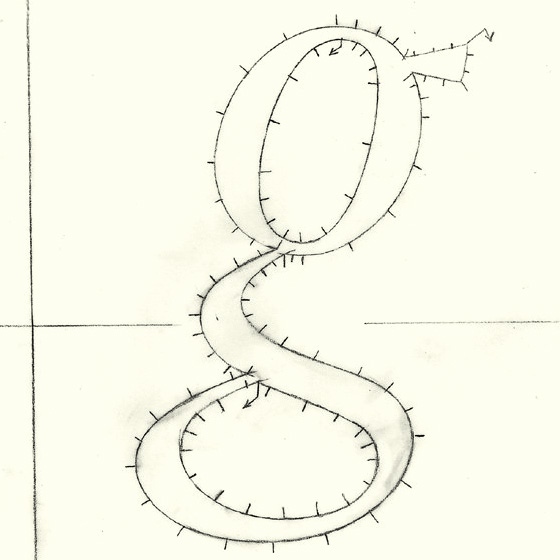
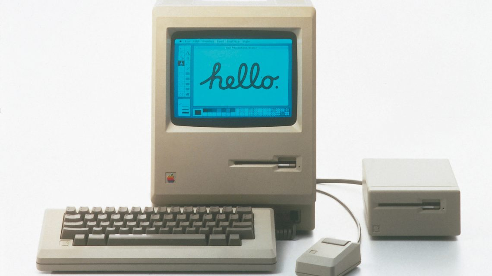
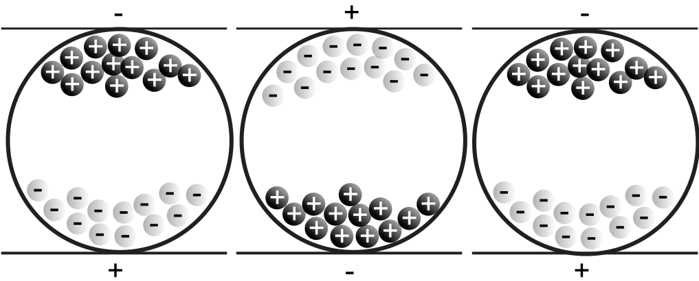
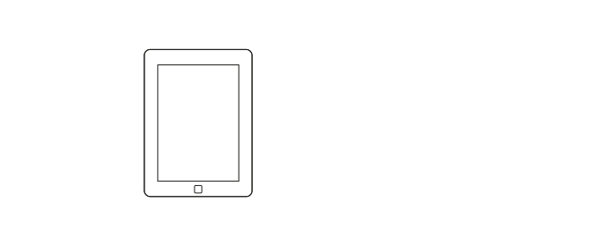
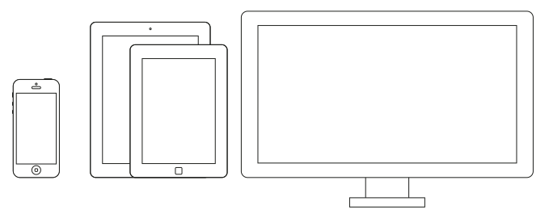

### HF Interactiondesign

# Bildschirme und Fonts

Stefan Huber, Zürich – 2018 <!-- .element: class="footer" -->

<style>
.reveal .embed-container {
  position: relative;
  padding-bottom: 50%;
  height: 0;
  overflow: hidden;
  max-width: 80%;
  height: auto;
}
.reveal .embed-container iframe,
.reveal .embed-container object,
.reveal .embed-container embed {
  position: absolute;
  top: 0;
  left: 0;
  width: 100%;
  height: 100%;
}
</style>


--s--
## Übersicht

* **08:15**
* Organisation
* Rückschau & Festigung
* Bildschirme und Fonts
* **11:40** · Ende
--s--
# Organisation
* Kein Lab
* Severin: [→ GitHub Education](https://education.github.com/partners/schools)
* GitHub → Probleme mit Push?

--s--
# Organisation
* Sa 16.06.2018 – Technologiegeschichte der Schrift
* Fr 22.06.2018 – Bildschirme und Fonts (4 Lektionen)
* Fr 29.06.2018 – Bildschirme und Fonts (4 Lektionen)
--s--
# Organisation – Anfrage

* Event Mittwoch, 29. August 2018
* Jurist kommt
* Gibt es Fragen zu Schriftlizenzen?

--s--
# Rückschau

--s--

## Kathodenstralröhre
 <!-- .element: class="pic" -->

--s--
## Fonts werden Digital
 <!-- .element: class="pic" -->

--s--
## Systeme ohne Monitor
 <!-- .element: class="pic" -->

--s--
## Erste WYSIWYG-Systeme
 <!-- .element: class="pic" -->
--s--
## Erste WYSIWYG-Systeme
 <!-- .element: class="pic" -->
--s--
## Ikarus

 <!-- .element: class="pic" -->


--s--
## Apple und TrueType
 <!-- .element: class="pic" -->

--s--
## MacOS 1 – Pixelfonts


--s--
## MacOS 7 – TrueType


--s--
## Quadratische Kurven (TrueType)


--s--
## Adobe und PostScript


 <!-- .element: class="pic" -->
--s--
## Kubische Kurven (PostScript)

--s--

## Laserdrucker
<div class='embed-container'>
  <iframe src="https://www.youtube.com/embed/WB0HnXcW8qQ" frameborder="0" allow="autoplay; encrypted-media" allowfullscreen></iframe>
</div>

--s--
# Screens
--s--

## Bildschirmauflösung
 <!-- .element: class="pic" -->
--s--
## Bildschirmauflösung
 <!-- .element: class="pic" -->
--s--
## Übung

* Bildschirmauflösung in [→ Spreadsheet](https://docs.google.com/spreadsheets/d/1C1EyRh_HGEXX_5WeOwIGFIHr4KgV5VvuxrLpnPiRV1U/edit?usp=sharing) eintragen
* Spalten B bis E verfollständigen

--s--

### Standards


--s--
## Bildschirmabmessung
15" Zoll von was?
--s--
## Übung
* Spalten F bis H verfollständigen

--s--
## Visuelle Grösse

* [Size Calculator](https://sizecalc.com/)

--s--
## Übung
* Kann die Spalte des abgegebenen Blattes auf dem Screen visuell gleich dargestellt werden? (nur Breite beachten)
* Meinungen?

--s--
## Auflösung

# 1920 ✕ 1080
--s--
## Auflösung
# 72 dpi
--s--
## Auflösung
# 1920 ✕ 1080 vs. 72 dpi
--s--
## Auflösungsdichte – DPI

Angabe, wieviel Pixel (Punkte) auf einer Strecke von 1 Inch (25.4 mm) dargestellt werden.

--s--
## Auflösungsdichte – DPI

1. Alle Screens haben 72 dpi
2. Alle Mac haben 72 dpi, alle PC haben 92 dpi
3. Alle Mac haben 72/144 dpi, alle PC haben 92 dpi
4. Es gibt keine Regel

--s--

## DPI Wert ermitteln
Höhe oder Breite des Bildes in Pixel <br>÷<br> Höhe oder Breite in Ausgabe (in Inch) <br>=<br> Auflösung in DPI (Dots per Inch)
--s--
## Rechnungsbeispiel

Höhe oder Breite des Bildes in Pixel <br>÷<br> Höhe oder Breite in Ausgabe (in Inch) <br>=<br> Auflösung in DPI (Dots per Inch)
>> 3000 Pixel ÷ 10 Inch (25,4 cm) = 300 Dots per Inch

--s--
## Übung

* Wieviele Punkte (Pixel) pro Inch (DPI) hat euer Screen? (Spalte J)
--s--
## Auflösungsdichte – DPI

1. Alle Screens haben 72 dpi
2. Alle Mac haben 72 dpi, alle PC haben 92 dpi
3. Alle Mac haben 72/144 dpi, alle PC haben 92 dpi
4. Es gibt keine Regel

--s--
## CSS

--s--
## Übung

* Zeichne eine 1px Linie in CSS mit [→ Codepen](https://codepen.io/)
* Screenshot erstellen
* Screenshot untersuchen
--s--
## Device Pixel Ratio/Pixel Density

[The Ultimate Guide To iPhone Resolutions](https://www.paintcodeapp.com/news/ultimate-guide-to-iphone-resolutions)

--s--
## Media-Query mit Pixel Density
```css
@media
only screen and ( min-device-pixel-ratio: 2),
only screen and ( min-resolution: 2dppx)
{
  /* Definitionen hier */
}
```

[Support-Matrix für Browser](https://caniuse.com/#feat=css-media-resolution)
<!-- .element: class="footer" -->
--s--
## Media-Query mit DPI

```css
@media
only screen and ( min-resolution: 190dpi),
only screen and ( min-resolution: 75dpcm)
{
  /* Definitionen hier */
}
```
[Support-Matrix für Browser](https://caniuse.com/#feat=css-media-resolution)
<!-- .element: class="footer" -->
--s--
## Demo

* [Testseite](https://bjango.com/articles/min-device-pixel-ratio/)

--s--

## Display Technologien
--s--

## Elektrophoretische Anzeige


--s--
## Geräte mit eInk

--s--
## LCD-Anzeige


--s--

## Geräte mit LCD

--s--
#### OLED

<video controls>
  <source src="./img/REC016.mp4" type="video/mp4" />
  <source src="./img/REC016.webm" type="video/webm" />
</video>

--s--
#### OLED


Bildquelle: [LG](http://www.lg.com/global/business/information-display/technology-solution/oled)
<!-- .element: class="footer" -->

--s--
#### OLED


Bildquelle: [Gamezone/LG](https://www.mweb.co.za/games/NewsArticles/tabid/2561/Article/30977/Samsung-QLED-How-does-its-display-work-and-is-it-better-than-OLED.aspx)
<!-- .element: class="footer" -->


--s--
## Bildwiederholrate


* Animation flüssig: ab [20 – 30 Frames pro Sekunde (fps)](https://en.wikipedia.org/wiki/Frame_rate#/media/File:Animhorse.gif)
* Ideal: [60 Frames pro Sekunde](https://www.youtube.com/watch?v=pfiHFqnPLZ4)
* iPad Pro? Filme? TV? Games?

--s--
## Kennzahlen zu Bildschirmen
* [Lichtstärke – Lumen](https://de.wikipedia.org/wiki/Lumen)
* [Leuchtdichte – Nits](https://de.wikipedia.org/wiki/Leuchtdichte)
* [Farbraum](https://de.wikipedia.org/wiki/Farbraum)
