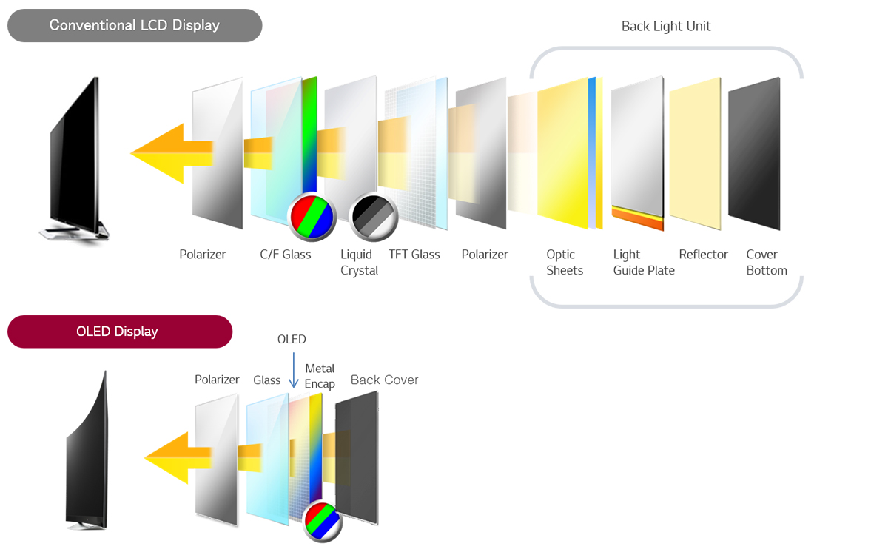
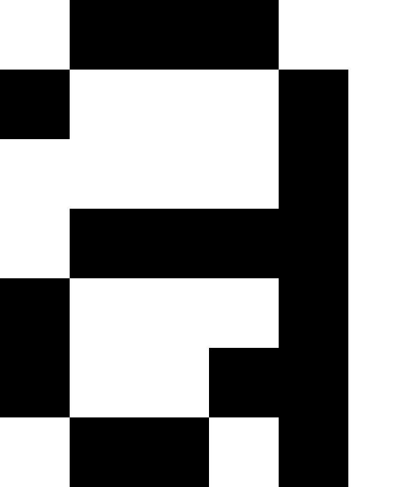
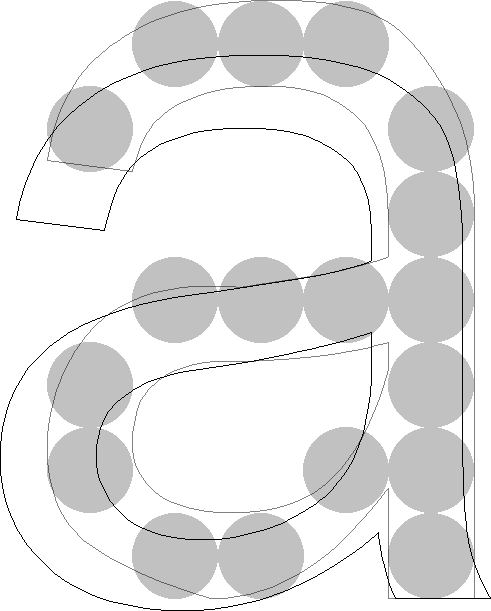
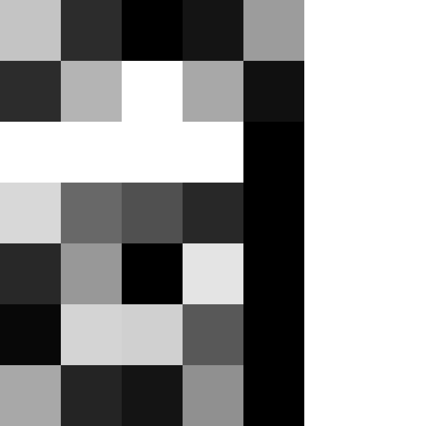
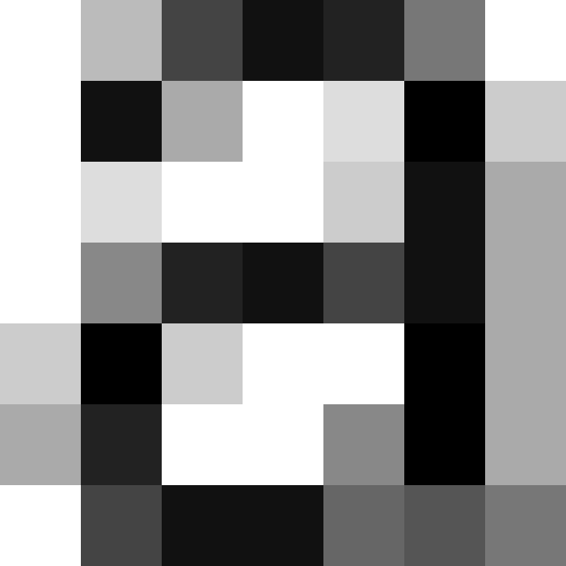
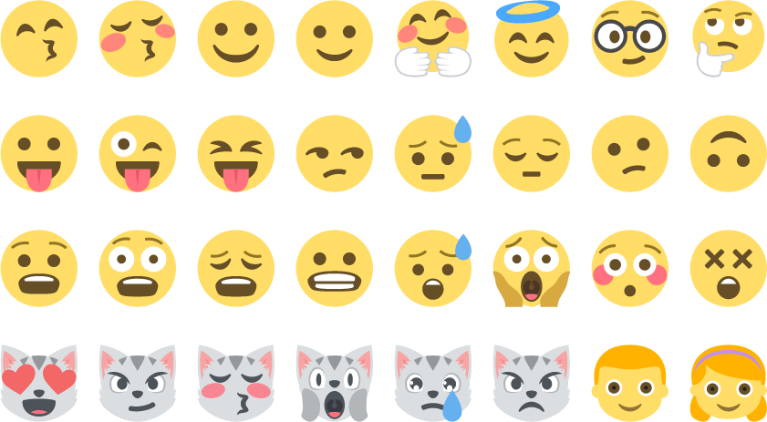

### HF Interactiondesign

# Bildschirme und Fonts

<style>
.reveal .embed-container {
  position: relative;
  padding-bottom: 50%;
  height: 0;
  overflow: hidden;
  max-width: 80%;
  height: auto;
}
.reveal .embed-container iframe,
.reveal .embed-container object,
.reveal .embed-container embed {
  position: absolute;
  top: 0;
  left: 0;
  width: 100%;
  height: 100%;
}
</style>

Stefan Huber, Zürich – 2018 <!-- .element: class="footer" -->
--s--
## Übersicht

* **08:15**
* Organisation
* Rückschau & Festigung
* Bildschirme und Fonts
* **11:40** · Ende

--s--
# Organisation
* Lab am Nachmittag
--s--
# Organisation
* ~~Sa 16.06.2018 – Technologiegeschichte der Schrift~~
* ~~Fr 22.06.2018 – Bildschirme und Fonts (4 Lektionen)~~
* Fr 29.06.2018 – Bildschirme und Fonts (4 Lektionen)
--s--
# Rückschau


--s--


# Screens
--s--
### Standards


--s--
## Visuelle Grösse

* [Size Calculator](https://sizecalc.com/)

--s--
## Auflösung
# 1920 ✕ 1080 vs. 72 dpi
--s--
## Auflösungsdichte – DPI

Angabe, wieviel Pixel (Punkte) auf einer Strecke von 1 Inch (25.4 mm) dargestellt werden.

--s--
## Rechnungsbeispiel

Höhe oder Breite des Bildes in Pixel <br>÷<br> Höhe oder Breite in Ausgabe (in Inch) <br>=<br> Auflösung in DPI (Dots per Inch)
>> 3000 Pixel ÷ 10 Inch (25,4 cm) = 300 Dots per Inch

--s--
## CSS

--s--
## Device Pixel Ratio/Pixel Density

[The Ultimate Guide To iPhone Resolutions](https://www.paintcodeapp.com/news/ultimate-guide-to-iphone-resolutions)

--s--
## Media-Query mit Pixel Density
```css
@media
only screen and ( min-device-pixel-ratio: 2),
only screen and ( min-resolution: 2dppx)
{
  /* Definitionen hier */
}
```
<!-- .element: class="footer" --> [Support-Matrix für Browser](https://caniuse.com/#feat=css-media-resolution)

--s--
## Media-Query mit DPI

```css
@media
only screen and ( min-resolution: 190dpi),
only screen and ( min-resolution: 75dpcm)
{
  /* Definitionen hier */
}
```
<!-- .element: class="footer" --> [Support-Matrix für Browser](https://caniuse.com/#feat=css-media-resolution)

--s--

## Display Technologien
--s--

## Elektrophoretische Anzeige


--s--
## Geräte mit eInk

--s--
## LCD-Anzeige


--s--

## Geräte mit LCD

--s--
#### OLED

<video controls>
  <source src="../KW25-screens/img/REC016.mp4" />
  <source src="../KW25-screens/img/REC016.webm" />
</video>

--s--
#### OLED




<!-- .element: class="footer" --> Bildquelle: [LG](http://www.lg.com/global/business/information-display/technology-solution/oled)


--s--
## Bildwiederholrate

* Animation flüssig: ab [20 – 30 Frames pro Sekunde (fps)](https://en.wikipedia.org/wiki/Frame_rate#/media/File:Animhorse.gif)
* Ideal: [60 Frames pro Sekunde](https://www.youtube.com/watch?v=pfiHFqnPLZ4)
* iPad Pro? Filme? TV? Games?

--s--
## Kennzahlen zu Bildschirmen
* [Lichtstärke – Lumen](https://de.wikipedia.org/wiki/Lumen)
* [Leuchtdichte – Nits](https://de.wikipedia.org/wiki/Leuchtdichte)
* [Farbraum](https://de.wikipedia.org/wiki/Farbraum)


--s--

# Bildschirme und Fonts

--s--
## Fonts

--s--
## Frage

Hat jemand die Beta-Version von MacOS 10.14 (Mojave) installiert?

--s--
## Übung

* Öffne «TextEdit»
* Erstelle ein Dokument (Text ohne Formatierung)
* Schreibe «Hallo» und erstelle einen Screenshot
* Untersuche den Screenshot. Was fällt auf?

--s--
## Vektor zu Pixel


 <!-- .element: class="pic" -->


--s--
## Schriftgrösse
 <!-- .element: class="pic" -->

--s--
## Renderer

 <!-- .element: class="pic" -->

--s--
## 1-Bit (Bitmap)

 <!-- .element: class="pic" -->

--s--
## Auflösung


Microsoft Arial Unicode – MS-Renderer – S/W – 8 bis 48 Pixel Höhe (PPM) <!-- .element: class="footer" -->

--s--
## Wirkung


  <!-- .element: class="pic" -->


Microsoft Arial Unicode – MS-Renderer – S/W – 8 bis 18 Pixel Höhe (PPM) <!-- .element: class="footer" -->


--s--
## Wirkung


 <!-- .element: class="picWide" -->

Microsoft Arial Unicode – 8 Pixel Höhe (PPM) – MS-Renderer – S/W <!-- .element: class="footer" -->


--s--
## Wirkung

 <!-- .element: class="picWide" -->

Microsoft Arial Unicode – 24 Pixel Höhe (PPM) – MS-Renderer – S/W <!-- .element: class="footer" -->

--s--
## Übung

* Öffne das Test-File und «rendere» den Buchstaben in Bitmap

--s--
## Unterschiede im Rendering

 <!-- .element: class="pic" -->

--s--
## FreeType-Renderer – S/W

 <!-- .element: class="pic" -->

13 Pixel Höhe (PPM) – Microsoft Arial Unicode <!-- .element: class="footer" -->

--s--
## MS-Renderer – S/W

 <!-- .element: class="pic" -->


13 Pixel Höhe (PPM) – Microsoft Arial Unicode <!-- .element: class="footer" -->

--s--
## Apple-Renderer – S/W

 <!-- .element: class="pic" -->

13 Pixel Höhe (PPM) – Microsoft Arial Unicode <!-- .element: class="footer" -->

--s--
## Hinting

--s--
## Outline

 <!-- .element: class="pic" -->

--s--
## Buchstabe a als Pixel ohne Hinting


 <!-- .element: class="pic" -->

--s--
## Buchstabe a als Outline mit Hinting

 <!-- .element: class="pic" -->

--s--
## Buchstabe a als Pixel mit Hinting

 <!-- .element: class="pic" -->


--s--
## TrueType vs. PostScript

* OpenType kennt beide «flavors»
* Woff 1/2 (Web-Fonts) sind technologisch (beinahe) OpenType-Fonts
* TrueType erlaubt bessere Steuerung von Hints

--s--
## TrueType mit von Hand eingefügten Hints


Microsoft Arial Unicode – MS-Renderer – S/W <!-- .element: class="footer" -->
--s--
## Autohints in PostScript


AMB Newut Medium – MS-Renderer – S/W <!-- .element: class="footer" -->


--s--
## Darstellung mit Graustufen

 <!-- .element: class="pic" -->


Microsoft Arial Unicode  – 8 bis 18 Pixel Höhe (PPM) – MS-Renderer – Graustufen   <!-- .element: class="footer" -->

--s--
## Wirkung
 <!-- .element: class="picWide" -->

Microsoft Arial Unicode – 8 Pixel Höhe (PPM) – MS-Renderer – Graustufen  <!-- .element: class="footer" -->

--s--
## Wirkung
 <!-- .element: class="picWide" -->

Microsoft Arial Unicode – 24 Pixel Höhe (PPM) – MS-Renderer – Graustufen  <!-- .element: class="footer" -->
--s--
## FreeType-Renderer – Graustufen
 <!-- .element: class="pic" -->

13 Pixel Höhe (PPM) – Microsoft Arial Unicode <!-- .element: class="footer" -->
--s--

## MS-Renderer – Graustufen
 <!-- .element: class="pic" -->

13 Pixel Höhe (PPM) – Microsoft Arial Unicode <!-- .element: class="footer" -->
--s--

## Apple-Renderer – Graustufen
 <!-- .element: class="pic" -->

13 Pixel Höhe (PPM) – Microsoft Arial Unicode <!-- .element: class="footer" -->


--s--
## Übung

* Öffne das Test-File und «rendere» den Buchstaben in 4-Bit
* Public-Url in Slack – [Text-Box](https://codesandbox.io/s/20q38opv2r)

--s--
## Subpixel-Rendering

* In Windows XP (2001) eingeführt
* 2003 auch in MacOS X
* 2018 wohl nicht mehr in MacOS X

--s--
## Standard Rendering


<!-- .element: class="footer" --> Bildquelle: [Subpixel-Rendering – Wikipedia](http://de.wikipedia.org/wiki/Subpixel-Rendering)

--s--
## Subpixel-Rendering


<!-- .element: class="footer" --> Bildquelle: [Subpixel-Rendering – Wikipedia](http://de.wikipedia.org/wiki/Subpixel-Rendering)
--s--
## Hochauflösende Darstellung & OLED


 <!-- .element: class="pic" -->


<!-- .element: class="footer" --> iOS 11 San Francisco Pro Text Regular 17pt
--s--
## Hochauflösende Darstellung & OLED

 <!-- .element: class="pic" -->

<!-- .element: class="footer" --> iOS 11 San Francisco Pro Text Regular 17pt auf iPhone X (Foto)


--s--

## Übung

* Untersuche das [Beispiel](https://lryy2pj4pq.codesandbox.io/) <!-- https://codesandbox.io/s/lryy2pj4pq -->
  * Welche Technik wurde eingesetzt
  * Was sind Nachteile gegenüber Besipel A

--s--
## Farbige Fonts


--s--
## Farbige Fonts

* Vier Standards → nur Probleme...
* Microsoft (COLR/CPAL)
* Apple (SBIX)
* Google (CBDT/CBLC)
* Adobe/Mozilla (SVG)

--s--
## Ideal...



--s--
## Fallback


--s--
## This is it...


--s--
## Unterlagen


* [Übersicht](https://signalwerk.github.io/IAD.LAB.DOC/)
* [Technologiegeschichte der Schrift](https://signalwerk.github.io/IAD.LAB.DOC/font-technology/)
* [Screens](https://signalwerk.github.io/IAD.LAB.DOC/screens/)
* [Fonts · Darstellung](https://signalwerk.github.io/IAD.LAB.DOC/font-rendering/)

--s--
## Übung

* Mach einen Screenshot vom Logo-Löwen auf [→ sfgz.ch](http://sfgz.ch/)
* Binde mit [→ Codepen](https://codepen.io/) und [→ imgur](https://imgur.com/) den Screenshot ein

--s--
## Film

<div class='embed-container'>
  <iframe src="https://player.vimeo.com/video/169809377" frameborder="0" webkitallowfullscreen mozallowfullscreen allowfullscreen></iframe>
</div>

--s--

## Kathodenstrahlröhre

* [Film Kathodenstrahlröhre (Cathode ray tube – CRT)](https://youtu.be/3BJU2drrtCM?t=2m17s)
* [Wikipedia](https://de.wikipedia.org/wiki/Kathodenstrahlr%C3%B6hre)

--s--
## Parametrische Fonts

* Prototypo
* metaflop.com
