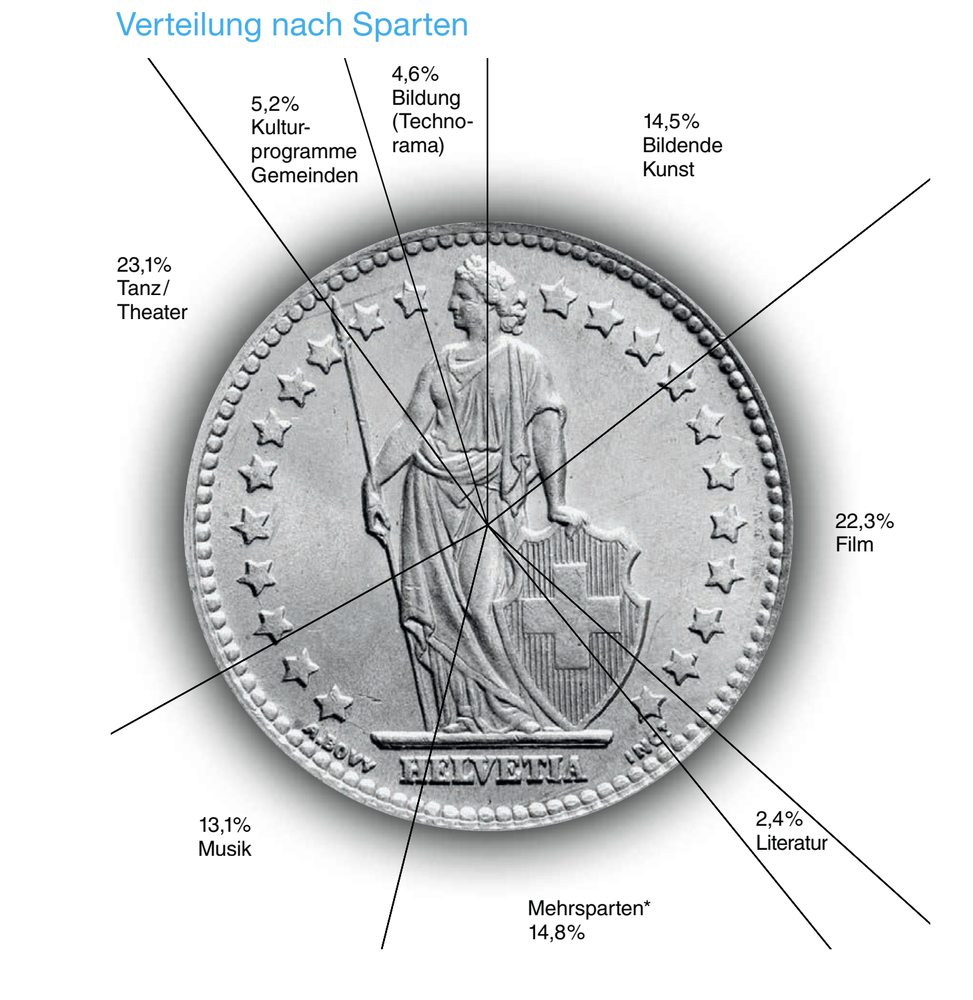

### HF Interactiondesign

# Cookie Clicker

Stefan Huber, Zürich – 2018 <!-- .element: class="footer" -->
--s--
## Übersicht

* **12:45**
* Organisation/News/Agenda
* Rückschau & Festigung
* Variable Fonts
* Cookie Clicker
* **16:15** · Ende

--s--
# Organisation
* 5. Oktober 2018 – Git mit Alex

--s--
## Arbeitslast

# Umfrage
* Wie war die Arbeitslast in den letzten Wochen? (😭 💤 ☺️)

--s--
## News
* Apple...
* 23. September 2018 – Film- und Medienförderungsgesetz
* 10 Jahre Google Chrome
* [→ Digitalisierungsberichte 2018](https://www.die-medienanstalten.de/publikationen/)
--s--
## Studierende


<div style="font-size: 0.6em; ">

<ul>
<li>Pascale → Grössen/Auflösungen von (neuen) iPhones im Vergleich zu SE?</li>
<li>Natasha → Wer ist der <a href="chrome://dino/">→ Google-Dino</a>?</li>
<li>Nils → Neues Design von Google Chrome</li>
<li>Marius → Grafik Google Chrome Marktanteil – Schweiz &amp; Welt</li>
<li>Tieu → Was ist <a href="https://en.wikipedia.org/wiki/SpiderMonkey">→ SpiderMonkey</a>?</li>
<li>Marc → Was ist <a href="https://en.wikipedia.org/wiki/Chrome_V8">→ V8</a>?</li>
<li>Lars → Was ist <a href="https://en.wikipedia.org/wiki/Chakra_%28JavaScript_engine%29">→ Chakra</a>?</li>
<li>Severin → Was ist Node und was hat es mit Google Chrome zu tun? Wann startete das Projekt?</li>
<li>Stephanie → Berichte zwei Fakten zum <a href="https://www.die-medienanstalten.de/publikationen/digitalisierungsbericht-audio/news/digitalisierungsbericht-audio-2018/">→ Digitalisierungsbericht Audio 2018</a></li>
<li>Matthias → Berichte zwei Fakten zum <a href="https://www.die-medienanstalten.de/publikationen/digitalisierungsbericht-video/news/digitalisierungsbericht-video-2018/">→ Digitalisierungsbericht Video 2018</a></li>
<li>Wolfgang → Was ist das Film- und Medienförderungsgesetz?</li>
<li>Nicole → Forderungen der <a href="https://www.game.de/games-foerderung/">→ Games-Branche</a> in Deutschland.</li>
</ul>


</div>


<div style="display: none; ">


* Pascale → Grössen/Auflösungen von (neuen) iPhones im Vergleich zu SE?
* Natasha → Wer ist der [→ Google-Dino](chrome://dino/)?
* Nils → Neues Design von Google Chrome
* Marius → Grafik Google Chrome Marktanteil – Schweiz & Welt
* Tieu → Was ist [→ SpiderMonkey](https://en.wikipedia.org/wiki/SpiderMonkey)?
* Marc → Was ist [→ V8](https://en.wikipedia.org/wiki/Chrome_V8)?
* Lars → Was ist [→ Chakra](https://en.wikipedia.org/wiki/Chakra_%28JavaScript_engine%29)?
* Severin → Was ist Node und was hat es mit Google Chrome zu tun? Wann startete das Projekt?
* Stephanie → Berichte zwei Fakten zum [→ Digitalisierungsbericht Audio 2018](https://www.die-medienanstalten.de/publikationen/digitalisierungsbericht-audio/news/digitalisierungsbericht-audio-2018/)
* Matthias → Berichte zwei Fakten zum [→ Digitalisierungsbericht Video 2018](https://www.die-medienanstalten.de/publikationen/digitalisierungsbericht-video/news/digitalisierungsbericht-video-2018/)
* Wolfgang → Was ist das Film- und Medienförderungsgesetz?
* Nicole → Forderungen der [→ Games-Branche](https://www.game.de/games-foerderung/) in Deutschland.

</div>

--s--
## Förderbereiche Kanton Zürich

 <!-- .element: class="pic" -->

<!-- .element: class="footer" --> Quelle: [Abstimmungszeitung Staatskanzlei Zürich – 23.09.2018](https://sk.zh.ch/internet/staatskanzlei/de/die_staatskanzlei/veroeffentlichungen/abstimmungszeitung/_jcr_content/contentPar/downloadlist/downloaditems/_09_abstimmungszeitu.spooler.download.1533798603445.pdf/Abstimmungszeitung_23_September_2018.pdf)

--s--
## Förderbereiche Kanton Zürich

 <!-- .element: class="pic" -->

<!-- .element: class="footer" --> Quelle: [Abstimmungszeitung Staatskanzlei Zürich – 23.09.2018](https://sk.zh.ch/internet/staatskanzlei/de/die_staatskanzlei/veroeffentlichungen/abstimmungszeitung/_jcr_content/contentPar/downloadlist/downloaditems/_09_abstimmungszeitu.spooler.download.1533798603445.pdf/Abstimmungszeitung_23_September_2018.pdf)

--s--
## Förderbereiche Kanton Zürich

> Damit künftig auch andere **audiovisuelle Darstellungsformen gefördert werden**, hat die **Kommission** für Bildung und Kultur des Kantonsrates **am 12. Dezember 2017** ein Postulat eingereicht. Das Postulat verlangt, dass der kantonale Beitrag  an die Zürcher Filmstiftung ab 2022 an die Bedingung geknüpft wird, **einen angemessenen Anteil des kantonalen Geldes für die Förderung neuer audiovisueller Formate** und Darstellungsformen (wie Videospiele und andere interaktive Formate) einzusetzen.


<!-- .element: class="footer" --> Quelle: [Abstimmungszeitung Staatskanzlei Zürich – 23.09.2018](https://sk.zh.ch/internet/staatskanzlei/de/die_staatskanzlei/veroeffentlichungen/abstimmungszeitung/_jcr_content/contentPar/downloadlist/downloaditems/_09_abstimmungszeitu.spooler.download.1533798603445.pdf/Abstimmungszeitung_23_September_2018.pdf)


--s--
## Agenda
* 15. - 16. September 2018 – [→ Maker Faire Zürich](https://www.makerfairezurich.ch/de/)
* 29. - 30. September 2018 – [→ DIY-Gathering «Flick The World»](https://mechatronicart.ch/blog/diy-gathering-flick-the-world)
* 9. - 11. November 2018 – [→ gameZfestival 18](http://www.gamezfestival.ch/)
* 24./25. November 2018 – [→ Vintage Computer Festival](https://www.vcfe.ch/)


--s--
# Rückschau


--s--
## Datentypen

* `"Text"` → Strings (Text) immer in `""` oder `''`
* `15` → Zahlen ohne `""`/`''`


--s--
## Variablen

### use

```js
let counter = 0;

counter = counter + 1;
```


--s--
## Nützliches

`console.log("hello world");`  
→ In Entwickler-Konsole etwas ausgeben

### use
```js
let counter = 0;
counter = counter + 1;
console.log(counter);
```

--s--
## Funktion

* Eine Funktion ist ein Teil des Programms, der gezielt aufgerufen werden kann.

### use
`alert("hello world");`  
→ Aufruf der Funktion alert mit dem String als Parameter.

--s--
## Funktion speichern

### use
```js
let clicker = function() {
  console.log("hello world");
}

clicker();
clicker();
clicker();
```

--s--
## DOM

`document.getElementById("cookie")` → liefert eine Referenz zum Dom-Objekt mit der `id="cookie"`

### use
```js
let cookie = document.getElementById("cookie")

cookie.classList.add("big");
cookie.classList.remove("round");

```
--s--
## Event Listener

`cookie.addEventListener("click", clicker)`  
→ bei einem klick auf das Element (`cookie`), wird die funktion `clicker` ausgeführt;

### use

```
let clicker = function(e) {
  alert("hello world");
}

cookie.addEventListener("click", clicker);
```
--s--
## HTML schreiben

`counter.innerHTML = "Hello world";`  
→ schreibt in das Element (`counter`) einen HTML-String.

--s--
# CLI
--s--
## CLI

* `cd ...` → in ein Verzeichnis wechseln (change directory)
* `ls` → inhalt im aktuellen Verzeichnis anzeigen
* `mkdir test` → Verzeichnis `test` erstellen
* `rm -r test` → Verzeichnis `test` löschen

--s--
## GIT
5. Oktober 2018 – Git mit Alex


--s--
# Variable Fonts


--s--
## Variable Fonts aufbereiten
* [→ GIT-Repo](https://github.com/logrinto/IAD2017.variable-fonts)
* [→ vfb2ufo](https://blog.fontlab.com/font-utility/vfb2ufo/)
* gleiche Anzahl Punkte
* gleiche Reihenfolge der Konturen
* Prüfen ob alles stimmt

--s--
# Cookie Clicker

--s--
## Animation

* Über neue `class` anstossen
* Über Transition oder Animation animieren

--s--
## Anstossen


### use
```js
let cookie = document.getElementById("cookie")

cookie.classList.add("bounce");

```
--s--
## Transition

Definiert, wie von einem Objekt-Zustand in den Nächsten übergeführt wird.  
[→ Editor](https://matthewlein.com/tools/ceaser) [→ Beispiele](http://css3.bradshawenterprises.com/transitions/) [→ Beispiele](http://animista.net/)

### use
```css
#cookie {
  transition: transform 1s; /* transform 1s ease */
  transform: scale(1);
}

#cookie.bounce {
  transform: scale(0.5);
}
```

--s--
## Animation
Ermöglicht diverse Zwischenschritte der Animation.  
[→ Editor](http://cssanimate.com/) [→ Editor](http://angrytools.com/css/animation/)

### use
```css
.bounce {
  animation-duration: 1s;
  animation-name: bounce;
}

@keyframes bounce {
  0%,
  100% {
    transform: scale(1);
  }
  50% {
    transform: scale(0.9);
  }
}

```


--s--
## Freies Arbeiten

→ Abgabedatum
