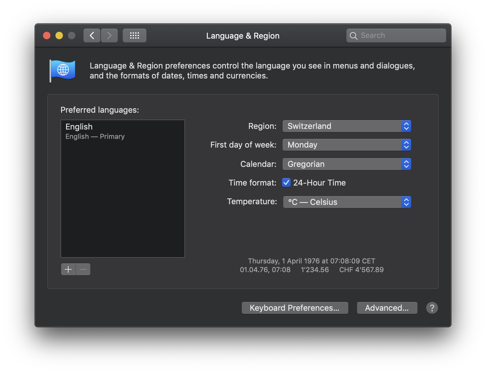
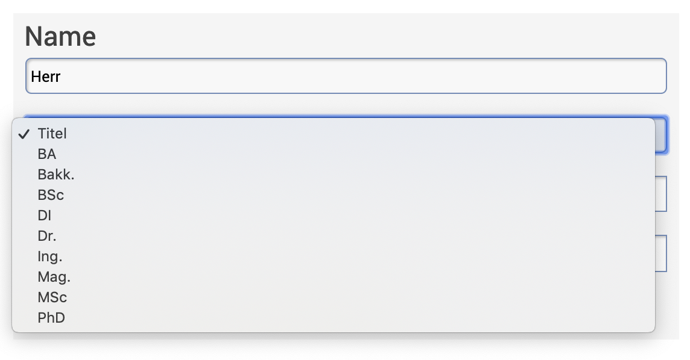

### HF Interactiondesign

# Lokalisierung · Internationalisierung

Stefan Huber, Zürich – 2019 <!-- .element: class="footer" -->
--s--
## Übersicht

* **12:45**
* Organisation/News/Agenda
* Lokalisierung · Internationalisierung
* Arbeit · Human-centered design
* **16:15** · Ende

--s--
# Organisation

--s--
## Politik und Gesellschaft

* Inputs & Rückmeldung?
* [Auswertung](https://umfragen.sfgz.ch/kurs/518528)

--s--
## Arbeitslast

# Umfrage
* Wie war die Arbeitslast in den letzten Wochen? (😭 💤 ☺️)
--s--
## Diplomausstellung & Thesis

* Habt ihr Lust auf eine Website/Publikation-Kombi für die Thesis?
* Ein Layout für alle Thesis-Arbeiten?
* Machen wir eine Diplomausstellung im Schaufenster?!

--s--

## Lohnumfrage
--s--
## News

* [EU-Urheberrechtsreform](https://netzpolitik.org/tag/eu-urheberrechtsreform/)
* [Facebook Crash – 13. März 2019](https://www.abc.net.au/triplej/programs/hack/heres-where-we-went-online-when-facebook-and-insta-crashed/10921648)
* [Chrome Exploit – 7. März 2019](https://www.forbes.com/sites/daveywinder/2019/03/07/google-confirms-serious-chrome-security-problem-heres-how-to-fix-it/#6177246d2002)

--s--
## Agenda
* [29. Mai – 2. Juni 2019 · The Libre Graphics Meeting](https://libregraphicsmeeting.org/2019/)
* [11. Mai 2019 – uxcamp](http://uxcamp.ch/)
--s--
## Huawai-App Natasha
--s--
# Lokalisierung · Internationalisierung

--s--
## Lokalisierung (l10n)

Mit «Lokalisierung» meint man den Vorgang, wie man Content und Produkte **an einen Kulturkreis anpasst**.
--s--
## Lokalisierung (l10n)

* Sprache
* Wähnrung
* Kulturelle Referenzen
* Farben
* Zeitangaben
--s--

## Internationalisierung (i18n)

Bei der «Internationalisierung» geht es darum **ein System oder Produkt so zu gestalten**, dass später **eine Lokalisierung möglich** ist.
--s--
## Internationalisierung (i18n)

* Dimensionen ermöglichen
* Fallbacks
* Templating

--s--

## Text

* Was habt Ihr für Erfahrungen gemacht?
* Andere Sprachen?
* Andere Kulturkreise?

--s--
## Text – Dimensionen

--s--

 <!-- .element: class="pic" -->

<!-- .element: class="footer" --> Quelle: [skyscanner](https://www.skyscanner.ch)
--s--

## Text – Individualisierung
 <!-- .element: class="pic" -->

--s--

## Unicode

Das Unicode Konsortium wurde geschaffen um eine Standardisierung zu erreichen, welcher **Wert/Zeichencode (Codepoint)** welchem **Schriftzeichen (Glyph)** entspricht.

--s--

## Vorläufer
* Diverse Standards für verschiedene Betriebsysteme und Sprachregionen
* [ASCII](http://ascii-table.com/) diente für die ersten 127 Zeichen des späteren Unicode
--s--

## Unicode Version 1 · Oktober 1991
* 7161 Zeichen
* 24 Schriftsysteme
--s--

## Unicode Version 12 · März 2018
* 137 993 Zeichen
* 150 Schriftsysteme
--s--

## Beispiel

* Wert 65 entspricht einem lateinischen A (Grossbuchstabe)
* Notation meist in Hex `U+0041`
* In HTML in DEC `&#65;` oder HEX `&#x41;` geschrieben.
* [Unicode Eintrag für A](http://unicode.org/cldr/utility/character.jsp?a=0041)

--s--

## Encoding

Beim Encoding wird festgehalten, wie der Codepoint abgespeichert wird.

### Verbreitete Encodings für Unicode
* [UTF-8](https://en.wikipedia.org/wiki/UTF-8)
* UTF-16 (nur verwenden, wenn UTF-8 nicht möglich)
* UTF-32 (nur verwenden, wenn UTF-8 nicht möglich)

### Beispiel
* A = BIN `01000001` in UTF-8 Encoding

--s--

## Falsches Encoding

Wörter → Wˆrter

Encoding «Windows Latin 1» als «Mac OS Roman» interpretiert.
--s--
## Fehlende Glyphen – replacement character

W□rter – W�rter

--s--

## Noto
* [Google-Font Noto](https://www.google.com/get/noto/)
* Ziel: alle Zeichen des Unicode-Standards
* «No Tofu»
* «replacement character» □ = Tofu

--s--

## Übersetzungen

* Manuell
* Maschninell

--s--

## Schreibweise

--s--

## ß oder ss

Grösse: 80 m  
Größe: 80 m

--s--

## US oder UK

color gray  
colour grey

--s--

## Vergleiche & Bezüge

--s--
## Saarland

«… ist etwa doppelt so groß wie das Saarland.»

~ 2570 km²

--s--

## Vorwissen

«Noch während der chinesischen Kulturrevolution …»

~ 1966 – 1976
--s--
## Vorwissen

«Noch während dem 2. Weltkrieg …»

~ 1939 – 1945

--s--

## Typografie

--s--

## Schweiz

«Hallo Welt!»

«Ich lese die Site ‹Typo-Nerd› täglich.»

--s--

## Deutschland

„Hallo Welt!“  

„Ich lese die Site ‚Typo-Nerd‘ täglich.“

--s--

## Französisch

« Bonjour ! »  

Jean a dit : « C'est la ‹ morale du film › »

--s--

## Englisch

“The best is yet to come.”

‘The best is yet to come.’

--s--

## Laufrichtung des Textes
--s--
## left to right (ltr) und right to left (rtl)

עברית

Hebräisch ist eine häufig verwendete rtl Sprache (Wortbedeutung: Hebräisch)

--s--

## Vertikale Laufrichtungen

* [Beispiel MDN](https://developer.mozilla.org/en-US/docs/Web/CSS/writing-mode)
--s--

## Sortierung – Deutscher Sprachraum

* DIN 5007 Variante 1 = Lexikon
* DIN 5007 Variante 2 = Telefonbuch
* Österreichische Sortierung (Telefonbuch)
--s--

## DIN 5007 Variante 1
* Göbel
* Goethe
* Goldmann
* Göthe
* Götz

**ö = o**

--s--

## DIN 5007 Variante 2
* Göbel
* Goethe
* Göthe
* Götz
* Goldmann

**ö = oe**
--s--

## Österreichische Sortierung
* Goethe
* Goldmann
* Göbel
* Göthe
* Götz

**ö folgt auf o**
--s--

## Personennamen & Titel

<!-- .element: class="footer" --> Beispiel der [Wiener Staatsoper](https://www.wiener-staatsoper.at/)
--s--
## Was noch Fehlt

* Masseinheiten
* Datum/Zeit
* Geografie/Adressen
* Geld/Bank

--s--
## Arbeit · Human-centered design

* Abgabe & Präsentation

--s--
