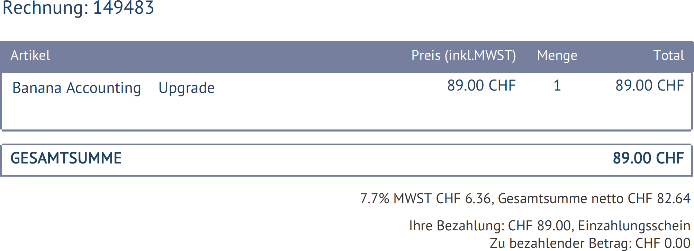

<style>

.reveal div.example {
  background-color: #ddd;

  padding-top: 0.7rem;
  padding-right: 1.2rem;
  padding-bottom: 0.9rem;
  padding-left: 1.2rem;

  margin-top: 1rem;
  margin-bottom: .3rem;
}

.reveal div.example--h1 {
  font-size: 2rem;
}

.reveal div.example--rtl {
  text-align: right;
}

</style>


### HF Interactiondesign

# Lokalisierung · Internationalisierung

Stefan Huber, Zürich – 2019 <!-- .element: class="footer" -->
--s--
## Übersicht

* **12:45**
* Organisation/News/Agenda
* Lokalisierung · Internationalisierung
* Arbeit · Human-centered design
* **16:15** · Ende

--s--

## 23. März 2019
* Abgabe der Arbeit «[Dokumentation · Human‑centered design](/exercise-human-centered-design/)» auf 12. April 2019 verschoben.
* Hausaufgabe: «[Dokumentation · Human‑centered design](/exercise-human-centered-design/)» weiterführen
--s--

## 30. März 2019
* Unterricht: etwa ~1 – 1.5 h Zeit an «[Dokumentation · Human‑centered design](/exercise-human-centered-design/)» in der Klasse zu arbeiten.
* Hausaufgabe: «[Dokumentation · Human‑centered design](/exercise-human-centered-design/)» weiterführen
--s--

## 6. April 2019
* Nachmittag: Freies Arbeiten an «[Dokumentation · Human‑centered design](/exercise-human-centered-design/)» (für Personen, die an keinen Workshops teilnehmen)
--s--

## 12. April 2019
* Kurzpräsentation «[Dokumentation · Human‑centered design](/exercise-human-centered-design/)» in der Klasse
--s--

## Huawai-App Natasha

--s--
# Rückschau

--s--
## Lokalisierung (l10n)

Mit «Lokalisierung» meint man den Vorgang, wie man Content und Produkte **an einen Kulturkreis anpasst**.
--s--
## Lokalisierung (l10n)

* Sprache
* Wähnrung
* Kulturelle Referenzen
* Farben
* Zeitangaben
--s--

## Internationalisierung (i18n)


Bei der «Internationalisierung» geht es darum **ein System oder Produkt so zu gestalten**, dass später **eine Lokalisierung möglich** ist.
--s--
## Internationalisierung (i18n)

* Dimensionen ermöglichen
* Fallbacks
* Templating
--s--
## Korrigenda letze Woche

--s--

## Unicode Version 12 · März 2019
* 137 993 Zeichen
* 150 Schriftsysteme

--s--


## Schreibweise


--s--

## ß oder ss
<div class="example example--h1">
Grösse: 80 m <br />
Größe: 80 m
</div>


--s--


## Typografie


--s--

## Schweiz

<div class="example example--h1">
«Hallo Welt!»
</div>

<div class="example example--h1">
«Ich lese die Site ‹Typo-Nerd› täglich.»
</div>
--s--

## Deutschland

<div class="example example--h1">
„Hallo Welt!“  
</div>

<div class="example example--h1">
„Ich lese die Site ‚Typo-Nerd‘ täglich.“
</div>
--s--


## Französisch

<div class="example example--h1">
« Bonjour ! »  
</div>

<div class="example example--h1">
Jean a dit : « C'est la ‹ morale du film › »
</div>

--s--

## Englisch

<div class="example example--h1">
“The best is yet to come.”
</div>


<div class="example example--h1">
‘The best is yet to come.’
</div>
--s--
# Heute

* Masseinheiten
* Datum/Zeit
* Geld/Steuern
* Geografie/Adressen

--s--


## Masseinheiten

* [Internationales Einheitensystem (SI)](https://de.wikipedia.org/wiki/Internationales_Einheitensystem)
* Ausser Myanmar, Liberia und die USA
--s--
## Wie gross seit Ihr?

“I'm five and a half foot tall.”

--s--
## US Längenmass
* 1 Punkt (DTP) = ~0.3527 mm
* 72 Punkt (DTP) = 1 Zoll
* 1 Zoll = 2.54 cm
* 1 Fuss = 12 Zoll = 30.48 cm
* 1 Meile = 63 360 Zoll = ~1.61 km

--s--

## Papiergrössen

### US-Letter
* 8.5 × 11 Zoll =  215.9 × 279.4 mm

### A4
* 210 × 297 mm
--s--
## Papiergrössen


--s--
## Temperatur
* Welt – Grad Celsius (°C)
* USA – Grad Fahrenheit (°F)
--s--
## Zeit

* Zeit ist sehr Komplex
* Bitte nie selber etwas basteln. Immer Programm-Bibliotheken benutzen!

--s--

## 24-Stunden oder AM/PM

* AM/PM wird häufig in englischsprachigen Ländern verwendet
* Lateinamerika verwendet häufig AM/PM

--s--
## AM/PM Quiz

9:00 AM
--s--
## AM/PM Quiz

12:00 AM
--s--
## AM/PM Quiz

9:00 PM
--s--
## AM/PM Quiz

12:00 PM
--s--
## AM/PM

| AM/PM | [ISO 8601](https://en.wikipedia.org/wiki/ISO_8601) |
|-------|-----|
| 11:59 AM | 11:59 |
| 12:00 PM | 12:00 |
| 11:59 PM | 23:59 |
| 12:00 AM | 24:00 |

--s--

## Schaltsekunde


```txt
31.12.2011 23:59:59
31.12.2011 23:59:60 ← Schaltsekunde
01.01.2012 00:00:00
```

* Keine Logik
* Gewisse Firmen: über einen Tag verteilte Schaltsekunde


--s--
## Zeitzonen

* Versuch den Sonnenstand zu kompensieren
* Regionen/politische Einheiten zum Teil zusammen (China/Afganistan «Zeitsprung»)
* Können temporär ändern (Jahr 2000 Olymischen Sommerspiele in Australien)

--s--

### Zeitzonen


 <!-- .element: class="pic" -->

<!-- .element: class="footer" --> Quelle: [Wikipedia](https://en.wikipedia.org/wiki/File:World_Time_Zones_Map.png)
--s--


## UTC – Coordinated Universal Time
* Seit 1884 [Nullmeridian](https://de.wikipedia.org/wiki/Nullmeridian) durch Greenwich (England)
* Seit 1972 Koordinierten Weltzeit genannt (UTC – Coordinated Universal Time) davor Greenwich Mean Time (GMT)

--s--
### UTC – Coordinated Universal Time


<!-- .element: class="footer" --> Quelle: [Wikipedia](https://de.wikipedia.org/wiki/Nullmeridian)

--s--

## CET – Central European Time
* Mitteleuropäische Zeit (MEZ) oder Central European Time (CET)
* Für Europa von zentraler Bedeutung
* Auch UTC+1
--s--
### CET – Central European Time

 <!-- .element: class="pic" -->

<!-- .element: class="footer" --> Quelle: [Wikipedia](https://de.wikipedia.org/wiki/Mitteleurop%C3%A4ische_Zeit)

--s--

## Zeitzonen der USA
* [insgesammt 11 Zeitzonen](https://de.wikipedia.org/wiki/Zeitzonen_in_den_Vereinigten_Staaten)
* vier Zeitzonen auf dem zusammenhängenden Festlandgebiet
  * Eastern Time Zone – UTC−05:00
  * Central Time Zone – UTC−06:00
  * Mountain Time Zone – UTC−07:00
  * Pacific Time Zone – UTC−08:00
--s--
### Zeitzonen der USA

 <!-- .element: class="pic" -->


<!-- .element: class="footer" --> Quelle: [Wikipedia](https://en.wikipedia.org/wiki/File:US-Timezones-post-2007.png)
--s--

## Computer & Zeitzonen

* Server haben meist keine Zeitzone nach der Installation (UTC). Muss manuell eingestellt werden.
* Consumer-Geräte versuchen die Zeitzone meist zu erraten/ermitteln

--s--


## Sommerzeit

 <!-- .element: class="pic" -->


<!-- .element: class="footer" --> Quelle: [Wikipedia](https://en.wikipedia.org/wiki/Daylight_saving_time)

--s--


## Datum & Kalender
* Wir verwenden den [gregorianischen Kalender](https://de.wikipedia.org/wiki/Gregorianischer_Kalender)
* Seit 1582 von Papst Gregor XIII verordnet

--s--

## Jahr-2000-Problem

Kann sich noch jemand erinnern?
--s--
## Jahr-2000-Problem
* Schaltjahr falsch berechnet
* nur zwei Jahreszahlen statt vier gespeichert
  * 99 = 1999
  * 00 = 1900 statt 2000
--s--

## Regeln für Schaltjahre
* 1\. Regel: Jahreszahl durch vier ganzzahlig teilbaren = Schaltjahr
* 2\. Regel: Jahreszahl durch 100 ganzzahlig teilbaren = kein Schaltjahr (1. Regel überlegen)
* 3\. Regel: Jahreszahl durch 400 ganzzahlig teilbaren = Schaltjahr (2. Regel überlegen)
--s--

## Numerische Notation von Daten

| Standard | Format                     | Beispiel               |
|----------|----------------------------|------------------------|
| USA      | MM/DD/YYYY                 | 03/29/2000             |
| ISO 8601 | YYYY-MM-DD                 | 2000-03-29             |
| DIN 5008 | YYYY-MM-DD oder DD.MM.YYYY | 2000-03-29 / 29.3.2000 |
--s--

## Unix-Timestamp
* Sekunden seit 1. Januar 1970 um 0:00 Uhr
* Die Zahl kann ein Vorzeichen (Minus) haben
--s--

## Unix-Timestamp Beispiele
* 31. Dezember 1999, 23:59:59 = 946 684 799 000
* 22. November 1963, 18:30:00 = –192 778 200
--s--

## Jahr-2038-Problem


<!-- .element: class="footer" --> Quelle: [Wikipedia](https://de.wikipedia.org/wiki/Jahr-2038-Problem)

--s--


## Zahlungsverkehr
--s--


## Besteuerung
* Meist Steuer im Land des Konsumenten/Käufers
* Lokale Regulierung beachten
--s--

## Mehrwertsteuer in der Schweiz (MwSt)
* Drei Mehrwertsteuersätze
* oder befreit von Mehrwertsteuer
--s--

## Mehrwertsteuer Beispiel


--s--

## Bankverkehr
* wenn möglich IBAN (International Bank Account Number) verwenden
* IBAN kann aber auch geheim sein (Deutschland)

--s--

## Checks
* USA sehr verbreitet
--s--

## PayPal
* Gebühren fallen an (für Geschäftskunden)
* Meistverbreitetes rein elektronisches Zahlungsmittel

--s--

## Kreditkarten für Online-Shops

* Braucht Zahlungsprozessor
* Gebühren
* Bitte Kreditkarten-Nummern nicht speichern (ausser ihr seit absolute Profis)
--s--
## Kreditkarten für Online-Shops

* [Saferpay/SIX](https://www.six-payment-services.com/en/site/e-commerce/solutions/paymentsolution.html) (im Schweizer Markt)
* [datatrans](https://www.datatrans.ch/)
* [Stripe](https://stripe.com/ch)
* [shopify](https://www.shopify.de/zahlungsportal/schweiz)
--s--

## Twint
* Nur in der Schweiz
* Nur für Personen mit Smartphones
--s--

## Apple-Pay & Google Pay
* Nur für Personen mit Smartphones
* Smartphone bildet in Hardware kontaktlose Karte nach

--s--

## Geografie
--s--

## Kartenprojektion

* Meist [Mercator-Projektion](https://de.wikipedia.org/wiki/Mercator-Projektion)
* Verzerrung beachten
--s--
## Mercator-Projektion


 <!-- .element: class="pic" -->


<!-- .element: class="footer" --> Quelle: [Wikipedia](https://de.wikipedia.org/wiki/Mercator-Projektion#/media/File:Mercator-proj.png)

--s--
## Mercator-Projektion – Verzerrung


 <!-- .element: class="pic" -->

<!-- .element: class="footer" --> Quelle: [Wikipedia](https://en.wikipedia.org/wiki/Mercator_projection#/media/File:Worlds_animate.gif)

--s--

## Alternativen

* [Alternative Kartenprojektionen](https://en.wikipedia.org/wiki/List_of_map_projections)
* [Alternative Mercator-Projektionen](http://richarddmorey.org/map/)
* [XKCD](https://xkcd.com/977/)
--s--
## Postadressen


### Beispiel für England
```txt
Name
159 Brick Lane
London E1 6SB
```
### Beispiel für USA

```txt
Name
3605 N Damen Ave, Rear
60618 Chicago, IL
```
--s--

### Stockwerke


--s--

## Strassenlogik & Navigation

* Himmelsrichtungen
* Strassennummern

<style>
.reveal div.map-responsive{
    overflow:hidden;
    padding-bottom:55%;
    position:relative;
    height:0;
}
.reveal div.map-responsive iframe{
    left:0;
    top:0;
    height:100%;
    width:100%;
    position:absolute;
}
</style>

--s--

### Beispiel New York (Manhattan)


<div class="map-responsive">
    <iframe src="https://www.google.com/maps/embed?pb=!1m18!1m12!1m3!1d6043.751152669622!2d-73.95981316386695!3d40.76476126977315!2m3!1f0!2f0!3f0!3m2!1i1024!2i768!4f13.1!3m3!1m2!1s0x89c2588f046ee661%3A0xa0b3281fcecc08c!2sManhattan%2C+New+York%2C+NY%2C+USA!5e0!3m2!1sen!2sch!4v1553908088407!5m2!1sen!2sch" frameborder="0" style="border:0" allowfullscreen></iframe>
</div>

--s--

### Beispiel Washington
<div class="map-responsive">
  <iframe src="https://www.google.com/maps/embed?pb=!1m18!1m12!1m3!1d3105.088055169129!2d-77.02333333422055!3d38.89910164126649!2m3!1f0!2f0!3f0!3m2!1i1024!2i768!4f13.1!3m3!1m2!1s0x89b7c6de5af6e45b%3A0xc2524522d4885d2a!2sWashington%2C+DC%2C+USA!5e0!3m2!1sen!2sch!4v1553907503329!5m2!1sen!2sch" frameborder="0" style="border:0" allowfullscreen></iframe>
</div>

--s--
## Fragen?

* [Dokumentation](https://signalwerk.github.io/IAD.LAB.DOC/global-content/)
--s--
## Arbeit · Human-centered design

* Abgabe & Präsentation

--s--
