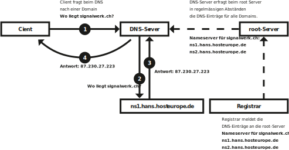

## HF Interactiondesign
# Praxisarbeit

Stefan Huber · Zürich · 2019 <!-- .element: class="footer" -->
--s--
## Übersicht

* **12:45**
* LAB
* **14:30**
* Pause
* **15:00**
* Freie Arbeit
* **16:15** · Ende
--s--

## HF Interactiondesign
# URL & DNS

Stefan Huber · Zürich · 2019 <!-- .element: class="footer" -->
--s--
## URL

# URL = uniform resource locator
* Wo eine Datei/Resource sich befindet
* Wie darauf zugegriffen wird (Protokoll)

--s--
## Bestandteile einer URL

# https://www.sfgz.ch/index.html

| Teil    | Bedeutung                 |
|---------|---------------------------|
| https:// | Angabe über das Protokoll |
| www     | Subdomain                 |
| sfgz  | Domain                    |
| ch      | Top-Level Domain          |
| index   | Dateiname                 |
| html    | Dateiendung               |

--s--
## http → Protokoll

# HTTP
## The Hypertext Transfer Protocol

# HTTPS
## HTTP over SSL

--s--
## Was ist ein Kommunikationsprotokoll?

Eine Vereinbarung zur Datenübertragung.
* mindestens zwei Teilnehmer
* durch Regeln definiert (Standards)

--s--
## Welcher Teil wird geregelt?

# Alle Teile des [OSI-Modell](https://de.wikipedia.org/wiki/OSI-Modell)
* Schicht 1 – Bitübertragungsschicht (Physical Layer)
* Schicht 2 – Sicherungsschicht (Data Link Layer)
* Schicht 3 – Vermittlungsschicht (Network Layer)
* Schicht 4 – Transportschicht (Transport Layer)
* Schicht 5 – Sitzungsschicht (Session Layer)
* Schicht 6 – Darstellungsschicht (Presentation Layer)
* Schicht 7 – Anwendungsschicht (Application Layer)
--s--
## Scherzhaft
# Layer 8 Problem
--s--
## Wer setzt die Regeln?
# [Internet Engineering Task Force](https://de.wikipedia.org/wiki/Internet_Engineering_Task_Force)
* Definieren Standards als RFC
  * [Request for Comments → Podcast](https://requestforcomments.de/)

RFC = Request for Comments <!-- .element: class="footer" -->
--s--
## http = Layer 7

# Anwendungsschicht
--s--
## Layer 7 – Application Layer
* Am nächsten beim User
* Implementierung einer Kommunikation in der Software
* Dateneingabe und -ausgabe
* Entscheidet ob Anfrage erfolgreich ist oder nicht

--s--
## HTTP ≠ HTTP

Verschiedene Revisionen

* [RFC 1945 HTTP/1.0 (1996)](https://tools.ietf.org/html/rfc1945)
* [RFC 2616 HTTP/1.1 (1999)](https://tools.ietf.org/html/rfc2616)
* [RFC 7540 HTTP/2 (2015)](https://tools.ietf.org/html/rfc7540)
--s--
##  HTTP/1.0 – 1996
* Ursrüngliche Implementierung
* Heute (fast) nicht mehr in Verwendung
* Für jede Anfrage wird ein eine Verbindung benötigt
* Textbasiert

--s--
##  HTTP/1.1 – 1999
* Verbindungen können wiederverwendet werden
* Daten können nun auch gesendet/verändert werden (DELETE & PUT)
--s--
##  HTTP/2 – 2015
* Mehrere Anfragen auf einmal an den Server
  * Durch SPDY (Google) und HTTP Speed+Mobility (Microsoft) inspiriert
  * Hauptgrund für Geschwindigkeitsgewinn
* Binäre Übertragung
* Mehr Kompressionsmöglichkeiten
* Push-Möglichkeit vom Server zum Client

--s--
## Domains
# http://www.sfgz.ch/index.html

| Teil    | Bedeutung                 |
|---------|---------------------------|
| www     | Subdomain                 |
| sfgz  | Domain                    |
| ch      | Top-Level Domain          |
--s--
# Domains – Koordination

  * International: [Internet Corporation for Assigned Names and Numbers – ICANN](https://www.icann.org/)
  * Schweiz: [NIC](https://www.nic.ch/de/)
--s--
# Beispiel – test.signalwerk.ch

Kann ich `.ch` kaufen?

--s--
# Beispiel – test.signalwerk.ch

Kann ich `signalwerk` kaufen?

--s--
# Beispiel – test.signalwerk.ch

Kann ich `test` kaufen?
--s--
# Wichtigkeit
* ch – Top-Level Domain
* sfgz – Domain
* www – Subdomain
--s--
# Top-Level Domain  
* .com
* .ch/.swiss
* [...](http://data.iana.org/TLD/tlds-alpha-by-domain.txt)

TLD = Top-Level Domain <!-- .element: class="footer" -->

--s--
## Registare – Domains kaufen

* Switch ist nicht mehr zuständig (seit 1. Januar 2015 )
* [Diverse Registrare](https://www.nic.ch/de/)
--s--
## .ch
* für Schweizer gut erkennbar als Domain
* Kann ohne Probleme erworben werden
* Fr. 10.– und 20.– pro Jahr → alle bieten die selbe Leistung
--s--
## .swiss
Gemäss BAKOM: «Gesuchsteller für einen .swiss Domain-Namen müssen eine ausreichende Verbindung zur Schweiz darlegen.»

* für Schweizer eher schwer als Domain erkennbar → hans.swiss
* kann mit Subdomain `www` unterstützt werden → www.hans.swiss
--s--
## Subdomains

--s--
## www...
* `www` ist nur eine mögliche Subdomain
* Unterscheidet sich technisch nicht von allen anderen Subdomains
--s--
## Subdomains

* Können beliebig vergeben werden
* Müssen nicht zentral registriert werden
* Handling auf Webserver
--s--
# Dateipfad

## sfgz.ch/kontakt/index.html
  * `kontakt` → Ordner – dient der Gliederung
  * `index` → Dateiname – möglichst sinnvoll
  * `html` → Dateiendung – [MIME](https://de.wikipedia.org/wiki/Multipurpose_Internet_Mail_Extensions)
--s--
## URL für den Browser
# Wie findet mein Brower meine Website (Domain)?
--s--
## Kommunikation über IP

* Schicht 3 – Vermittlungsschicht (Network Layer)

ISP = Internet protocol  <!-- .element: class="footer" -->
--s--
## Kommunikation an Adresse
* Jeder Client/Server hat eine Adresse
* Eindeutlig im «sichtbaren» Netzwerk
  * lokale Adressen
  * globale Adressen
--s--
## Internet protocol
* Version 4 → knapper Adressraum (4 × 8 bit)
* Version 6 → sehr sehr viele Adressen
--s--
## DNS
# Domain Name System
* Menschen sind schlecht mit Nummern
* Menschen sind ok mit Domains (Namen)
* DNS verwandelt Domains zu Nummern
--s--
## Domains für den Browser
* Browser lösst Domains in IP's auf
* DNS sind dezentral und abhängig vom Client/ISP-Provider

ISP = Internet Service Provider <!-- .element: class="footer" -->
--s--
## DNS – Browser

 <!-- .element: class="pic" -->
--s--
## DNS – Struktur

 <!-- .element: class="pic" -->

--s--
# Merci

<!--

# CSS-Boxmodel

* Treffen zwei Margins aufeinander «gewinnt» der grössere!
* [Erklärung](https://jonathan-harrell.com/whats-the-deal-with-margin-collapse/)

-->
